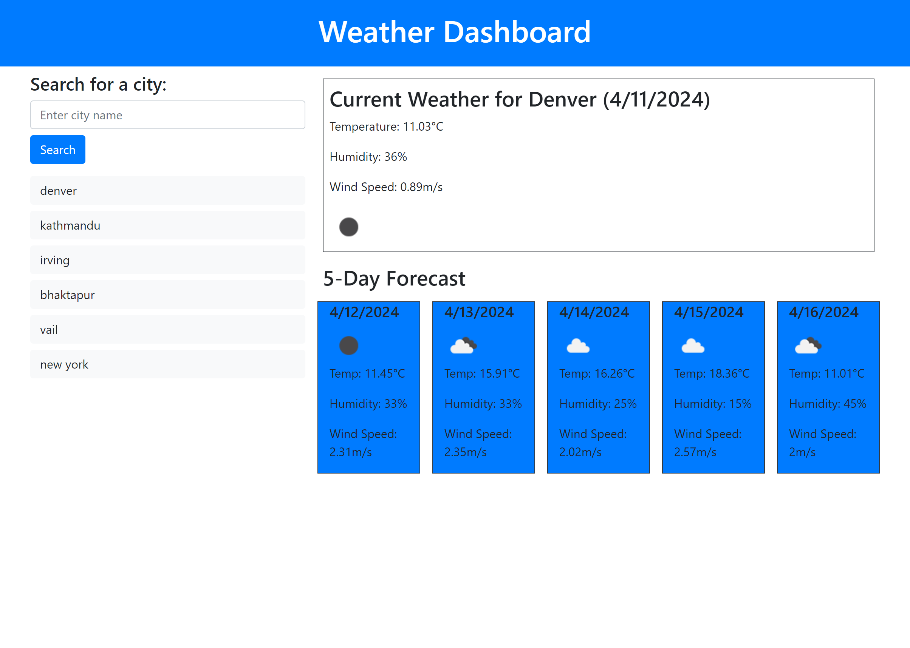

### Weather Dashboard

**Introduction**
The Weather Dashboard: Travel Planner is a dynamic web application designed to assist travelers in planning their trips by providing comprehensive weather forecasts. The dashboard allows users to search for multiple cities, displaying both current and upcoming weather conditions, helping to ensure an informed and pleasant travel experience.

**Features**
- **City Search**: Users can search for any city to see real-time and future weather conditions.
- **Current Weather Conditions**: Displays essential weather details such as temperature, humidity, and wind speed along with a visual icon representing current weather conditions.
- **5-Day Forecast**: Provides a five-day weather forecast showing temperature, wind speed, humidity, and weather condition icons for each day.
- **Search History**: Maintains a history of searched cities, allowing for quick reevaluation of previous searches.

**Getting Started**
To use the Weather Dashboard, simply navigate to the hosted web page, enter a city name in the search bar, and submit your query. The dashboard will immediately present you with the current weather conditions and a five-day forecast for that city. You can click on any previously searched city from the search history panel to quickly view its current and future weather conditions again.

**Technologies Used**
- HTML5
- CSS3
- JavaScript
- OpenWeather API for fetching weather data

**Installation**
No installation is necessary. The Weather Dashboard can be accessed via any standard web browser.

**Usage**
1. Enter the name of a city in the search bar.
2. Press enter or click the search button to submit the query.
3. View the weather data displayed on the dashboard.
4. Click on any city name in the search history to view its weather details again.

**Screenshots**

**URL**
https://rinjeeg.github.io/Weather-API/

**Sources**
https://chat.openai.com/
https://bootcampspot.instructure.com/courses/5271/external_tools/313
https://getbootstrap.com/
https://openweathermap.org/
